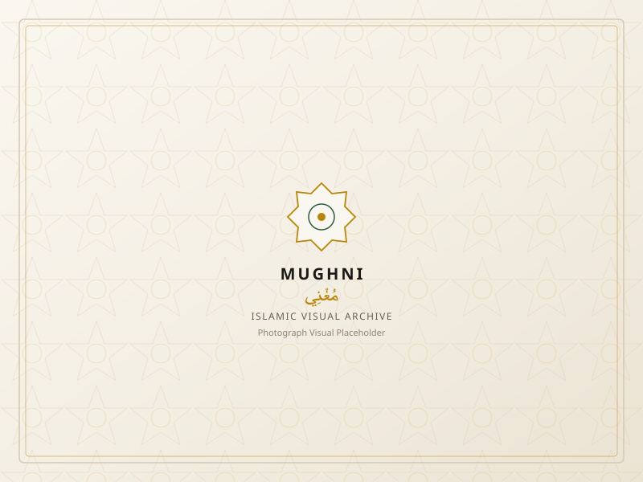

# MUGHNI — Islamic Visual Archive (مُغْنِي)

> A museum-grade, portfolio-quality Islamic visual archive web application built with **HTML5**, **CSS3**, and **Vanilla JavaScript (ES6+)**. Engineered with a warm ivory and dark charcoal editorial aesthetic, subtle Islamic geometry, authentic visual documentation, bilingual English/Arabic (RTL) support, two-image comparison mode, and zero external libraries.



---

## 1. Overview

**MUGHNI (مُغْنِي)** is a specialized digital visual archive and cultural platform dedicated to preserving and exploring the architectural, calligraphic, and geometric heritage of Islamic visual culture worldwide. 

Rather than a generic image gallery, MUGHNI serves as a curated digital repository spanning sacred sanctuaries, classical Ottoman and Andalusian monuments, complex mathematical zillij tilework, illuminated manuscripts, pilgrimage traditions, and regional Islamic heritage from Central Asia to the historic walled city of **Harar** in Ethiopia.

---

## 2. Technologies Used

* **HTML5**: Fully semantic markup (`<header>`, `<main>`, `<section>`, `<article>`, `<aside>`, `<footer>`, `<dialog>` ARIA semantics, accessible form elements, and bilingual language tags).
* **CSS3**: Complete CSS custom property design system (Warm Ivory/Soft Sand/Deep Charcoal with antique gold and earthy forest green accents), CSS Grid, Masonry and Editorial layout engines, full Bidirectional / RTL styling (`[dir="rtl"]`), and `@media (prefers-reduced-motion)` accessibility support.
* **Vanilla JavaScript (ES6+)**: Modular code executed in strict mode (`"use strict";`), centralized reactive state management, bilingual translation dictionary (`i18n`), dynamic DOM updates, Web APIs (`localStorage`, `navigator.clipboard`, `navigator.share`, touch & pointer gestures), and defensive timer management.
* **Zero Dependencies**: 100% framework-free. No React, Vue, Angular, Next.js, Bootstrap, Tailwind, jQuery, npm build steps, backend services, or API keys required.

---

## 3. Curated Collections

MUGHNI organizes its 33 authenticated visual entries across eight thematic archives:

1. **Sacred Places**: The Kaaba at Dawn, The Prophet's Mosque Canopy Courtyard (Medina), Dome of the Rock on the Moriah Esplanade (Al-Quds), and the foundational Quba Mosque.
2. **Islamic Architecture**: Domes of the Blue Mosque (Istanbul), Court of the Lions Muqarnas Arches at the Alhambra (Granada), Turquoise Iwan Vaults of Isfahan, Colonnade of Sheikh Zayed Grand Mosque (Abu Dhabi), and the Horseshoe Arches of Cordoba.
3. **Qur'an & Calligraphy**: Gold-illuminated Thuluth manuscript folios, early 9th-century Kufic on indigo parchment, master calligrapher's reed pen (qalam) & soot ink studies, and cursive Diwani script compositions.
4. **Islamic Geometry**: Twelve-pointed star zillij mosaics (Fez, Morocco), structural muqarnas corbel honeycomb vaulting, pierced sandstone jali lattices (Fatehpur Sikri), and decagram girih woodwork ceilings.
5. **Ramadan**: Traditional brass fanous lanterns, crescent moon risings over historic minarets, authentic Medina dates for Iftar, and tranquil Taraweeh night prayer congregations.
6. **Hajj & Umrah**: Pilgrims circumambulating the Kaaba in unified Tawaf, the white tent city of Mina Valley, supplication at the Plain of Arafat, and visitation to the Rawdah Mubarak.
7. **Islamic World**: Registan Square madrassas on the Silk Road (Samarkand, Uzbekistan), Badshahi Mosque red sandstone courtyard (Lahore, Pakistan), Koutoubia minaret against the Atlas mountains (Marrakech), and the Sultan Qaboos Grand Mosque crystal chandelier (Oman).
8. **Islamic Ethiopia**: Dedicated collection highlighting the UNESCO World Heritage walled city of Harar Jugol, the historic central Jamia Mosque, traditional Harari vernacular interiors (*Gey Gar*), ancient Ethiopian Arabic/Ajami manuscripts, and the historic Buda Gate.

---

## 4. Advanced Features

* **Bilingual English & Arabic (RTL)**:
  * Seamless one-click switching between English and Arabic (`EN | العربية`).
  * Full document direction toggle (`dir="rtl"` / `dir="ltr"`), mirrored navigation drawers, aligned search icons, and native Arabic typography (`Amiri` / `Scheherazade New`).
  * Language preference saved in `localStorage`.
* **Three Gallery View Modes**:
  * **Grid**: Clean, balanced architectural cards.
  * **Masonry**: Vertical rhythm honoring differing photograph aspect ratios.
  * **Editorial**: Expansive horizontal cards with rich historical context, location tags, and architectural eras.
  * View preference saved in `localStorage`.
* **Visual Comparison Mode**:
  * Select any two visuals from the archive using the compare button on the card.
  * Side-by-side comparative inspection modal contrasting architectural era, location, country, collection, category, and tags.
* **Random Discovery ("✦ Discover")**:
  * One-click exploration button selecting a random treasure from the archive and launching the full-screen lightbox.
* **Featured Visual & Daily Inspiration**:
  * Large-scale editorial hero showcase of the featured visual.
  * Daily Inspiration section with verified contemplation from the Holy Qur'an (Surah Ar-Ra'd 13:28: *«أَلَا بِذِكْرِ اللَّهِ تَطْمَئِنُّ الْقُلُوبُ»* — *"Unquestionably, by the remembrance of Allah hearts are assured"*).
* **Multi-Attribute Live Search & Filters**:
  * Instant search while typing across *Title (English & Arabic)*, *Location*, *Country*, *Collection*, *Category*, *Description*, and *Tags*.
  * Result counter badge (`18 visuals found in Islamic Architecture`).
  * Dynamic filter pills and multi-criteria sorting (*Featured, Title A–Z, Title Z–A, Collection, Newest*).
* **My Collection (Persistent Curation)**:
  * Save visuals locally using the heart icon.
  * Live animated badge counter in the header.
  * Dedicated "My Collection" view filter with tailored empty state.
* **Full-Screen Lightbox**:
  * High-fidelity image viewport with 1x to 3x zoom and mouse drag/pan support.
  * Previous/Next navigation with seamless wrap-around looping.
  * Dynamic counter (`3 / 8`) reflecting active filtered subsets.
  * Defensive single-timer automated slideshow (3.5s interval) with auto-cleanup upon modal exit.
* **Keyboard Navigation & Touch Support**:
  * `←` / `→`: Previous and Next visual (auto-mirrored in RTL Arabic mode).
  * `Esc`: Close lightbox or comparison modal.
  * `Space`: Toggle slideshow play/pause.
  * `+` / `-`: Zoom in and out.
  * `R`: Reset zoom to 100%.
  * `C`: Save/unsave current visual to My Collection.
  * Touch swipe detection on mobile devices (`touchstart`/`touchend`).
* **Share & Download Integration**:
  * Native Web Share API (`navigator.share`) with direct clipboard copy fallback.
  * Direct image download with automatic filename sanitation and new-tab fallback.
* **Theme Engine**:
  * Warm Ivory light palette and Deep Charcoal dark theme.
  * Preserves muted antique gold and earthy green accents.
  * Persisted in `localStorage` and respects system `prefers-color-scheme`.
* **Accessible & Resilient**:
  * WCAG AA/AAA color contrast ratios.
  * Strict `@media (prefers-reduced-motion: reduce)` support.
  * Inline SVG placeholder fallback preventing layout shifts on broken or offline network states.

---

## 5. Project Structure

```text
mughni/
│
├── index.html            # Semantic HTML5 single-page application with EN/AR RTL
│
├── css/
│   └── style.css         # CSS3 custom properties design tokens, views, RTL styles
│
├── js/
│   └── script.js         # Modular Vanilla ES6+ architecture: State, Collections, i18n
│
├── assets/
│   └── images/
│       └── placeholder.svg # Fallback Islamic geometric SVG asset
│
└── README.md             # Project documentation, cultural context, setup guide
```

---

## 6. How to Run

Because MUGHNI is built purely with standard HTML5, CSS3, and JavaScript, no build tools, compilers, or npm installations are needed.

### Option 1: Direct File Launch
1. Open the project folder.
2. Double-click `index.html` or open it with Google Chrome, Mozilla Firefox, Microsoft Edge, or Safari.

### Option 2: Local HTTP Server (Recommended)
Running through a local web server ensures optimal testing of Web Share APIs, browser history states, and cross-origin image requests:

```bash
# Using Python 3:
python -m http.server 8000

# Or using Node.js:
npx serve .
```
Navigate to `http://localhost:8000` in your web browser.

---

## 7. Browser Feature Compatibility

* **Web Share API**: Supported on mobile browsers (Android Chrome, iOS Safari) and macOS Safari. On unsupported desktop environments, MUGHNI automatically falls back to copying the direct image URL to the clipboard with an alert toast.
* **Image Downloads**: Cross-origin image downloads from external public CDNs may be restricted by third-party CORS headers. MUGHNI attempts blob generation first, and gracefully falls back to opening the full-resolution photograph in a dedicated tab.
* **LocalStorage**: Used to preserve your saved "My Collection", theme preference, language choice, and view mode across browser sessions. In private or incognito browsing windows where localStorage is restricted, MUGHNI degrades gracefully in-memory without throwing runtime exceptions.

---

## 8. Content & Image Attributions

* **Content Integrity**: All locations, architectural styles, and eras represent authenticated historical and cultural heritage. Qur'anic citations are taken from authenticated public translations (Surah Ar-Ra'd 13:28).
* **Visual Sources**: Photographs are curated from high-resolution, publicly accessible archives via [Unsplash](https://unsplash.com) with individual attribution provided in the lightbox metadata bar for each visual.
* **License**: Open-source educational and portfolio project.
